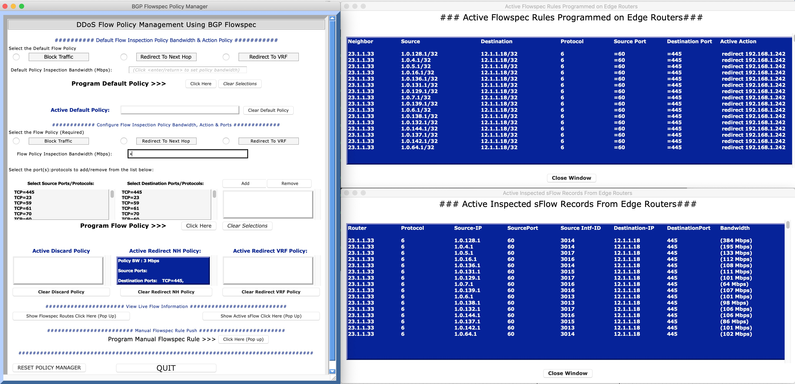

# BGP Flowspec Policy Manager & Flow Programmer

A Python Based application (with Tkinter GUI) for BGP Flowspec Flow programming.

The manager uses a backend sFlow collector (sFlow-RT) and Exabgp to find IPv4 and IPv6
DDOS flows, or flows that match configured inspection policy) and then programs the 
BGP Flowspec routes on the Edge routers.  

Below is a picture of the Flowspec UI

        Figure 1: FlowspecPolicyManager UI

The flows are discovered polling sFlow-RT via the API and then programmed on the 
edge routers using ExaBGPs API

The manager can be run on a VM or a BMS, but in addition it is all dockerized
and can be run in a container (instructions below)

For details on  EXABGP refer to this link: https://github.com/Exa-Networks/exabgp

Detals on sFlow-RT can be found here: https://sflow-rt.com/

INSTALLATION:
=============

To build your own local version all you need to do is install Docker and 
clone the git repository:

        git clone git@github.com:russellkelly/BGPFlowspecPolicyManager.git

Switch to the clone directory BGPFlowspecPolicyManager

        cd BGPFlowspecPolicyManager

Then in the cloned (BGPFlowspecPolicyManager) directory run:

        make build

This command runs build: (Builds the image flowspec-manager:latest).

The above Makefile command builds an image with the latest ExaBgp:master, and sFlow-RT
installed.  It also installs all the required dependencies in the docker image

There are a few dependencies needed on the local PC for the Tkinter GUI to run.  These 
are covered below.

This Application will run with Python 2.7 or Python 3 (though Python 3 has been less extensively tested).

Install the following packages if running Python 2.7 or 3.x:

- Python Requests module
- Python Pyyaml module
- Python Schedule Module

The commands to install on Windows (after installing Python 2.7.15 or 3.4) are below:

        python -m pip install requests
        python -m pip install pyyaml
        python -m pip install schedule
        python -m pip install win-inet-pton (needed on Windows only)

Similar commands can be run in Mac OSX or Linux using brew or apt-get.

Note: If you want to run this demo outside of a container (above) install 

EXABGP (version 4.0.10) : https://github.com/Exa-Networks/exabgp.git

sFlow-RT : https://sflow-rt.com/download.php

CONFIGURING AND RUNNING THE FLOWSPEC MANAGER
============================================

Once the git repository has been cloned locally and the images 
installed as above proceed with the
following steps:

Step 1: Customize the TopologyVariables.yaml File.
--------------------------------------------------

Amend the variables in the file below to match your topology :

TopologyVariables.yaml file.  (THIS IS THE ONLY FILE THAT NEEDS TO BE AMENDED)

Change the following in TopologyVariables.yaml:

The AS to match your topology

        Exabgp_as:
          as: *****

The Edge Flowspec Router details to match the topology

        EdgeRouters:
            - RouterID: ***.***.***.***
              AS: *****
              VRF: ***:***
              IPNH: ***.***.***.***

Step 2: Run the RenderConfigFiles.py Script
--------------------------------------------

To render the exabgp.conf file and the configurations for the edge 
routers (EdgeRouterConfigs.cfg).

        python RenderConfigFiles.py

The configuration snippets for the Edge routers can be implemented on the routers.  
The script will attempt to determine the local PCs public IP address.  Check the 
exabgp.conf 

Step 3: Create the Container
----------------------------

To start the container (running sFlow-RT and Exabgp locally) run:

        make flowspec

To check if sFlow-RT is running browse to http://localhost:8008.  This view of
the sFlow collector can be used to check that the edge routers are in fact sending
sFlow records to the collector.

A rudimentary telnet to localhost on port 5000 will connect to the Exabgp API

You can ssh to the local container by running .

        ssh flowspec@localhost -p 2022      (password is flowspec)

Step 4: Tune Topology Varibles File (if required)
-------------------------------------------------

The topology file can be edited to change the frequency the app iterates
and that sflow-RT is polled for new/changed flows.  

The timer between application run/poll to determine 
offending flows, the multiplier (of the App run time ) between Sflow
Polling. Max non-zero sFlow entries the application will iterate through, 
sorted from highest flow to lowest. Default for this is (5, 15 seconds 
and 4000 for the app runtime, sFlow multiplier, and the sFlow cache iteration 
respectively)

        AppRunTimer: 5
        SflowMultiplier: 3
        maxsflowentries: 4000

Finally, you can add remove specific TCP UDP ports to match on.  Additionally ICMP messages
can be added as required.  When the topology file is amended the main app will pick
up the changes and reflect in the GUI.  Ensure the YAML formatting is correct!

        PortList:
                - TCP=445
                - TCP=23
                - UDP=53
                - ICMP Echo-Reply=0
                - ICMP Echo-Request=8
                

Step 5: Run the Application
----------------------------

        python FlowspecPolicyManager.py
       
Thats it!

TROUBLESHOOTING
===============

Option 1:
---------

Within the application there is also a reset button that clears the BGP peers, removes the 
flow data etc.

Option 2:
---------

There is an option to restart the Exabgp and sflow-RT processes from within the container by running the script below.  Follow the steps below.

        ssh flowspec@localhost -p 2022      (password is flowspec)
        ./RestartContainerServices.sh
		
This can also be executed directly from the host machine

        docker exec flowspec-container bash /home/flowspec/RestartContainerServices.sh
        
The BGPFlowSpecManager script will need to be started afterwards.  

Option 3 :
----------

If there is some issue with the Application container it is very easy to recreate.

In the BgpFlowspecPolicyManager directory run the following:

        make clean
        
Recreate the container:

        make flowspec
        

