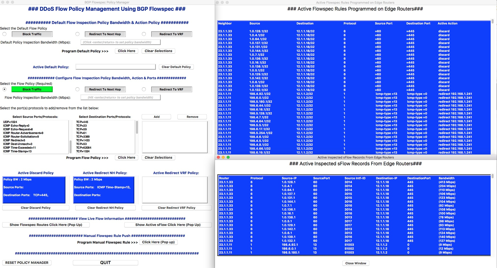

# BGP Flowspec Policy Manager & Flow Programmer

A Python Based application (with Tkinter GUI) for BGP Flowspec Flow programming.

The manager uses a backend sFlow collector (sFlow-RT) and Exabgp to find DDOS flows, 
or flows that match configured inspection policy) and then programs the BGP Flowspec 
routes on the Edge routers. 

Figure 1: Flowspec Policy Manager GUI
             

The flows are discovered polling sFlow-RT via the API and then programmed on the 
edge routers using ExaBGPs API

The manager can be run on a VM or a BMS, but in addition it is all dockerized
and can be run in a container (instructions below)

For details on  EXABGP refer to this link: https://github.com/Exa-Networks/exabgp

Detals on sFlow-RT can be found here: https://sflow-rt.com/

INSTALLATION:
=============

To build your own local version all you need to do is install Docker and 
clone the git repository:

        git clone git@github.com:russellkelly/BGPFlowspecPolicyManager.git

Switch to the clone directory SR_Demo_Repo

        cd BGPFlowspecPolicyManager

Then in the cloned (BGPFlowspecPolicyManager) directory run:

        make build

This command runs build: (Builds the image flowspec-manager:latest).

The above Makefile command builds an image with the latest ExaBgp:master, and sFlow-RT
installed.  It also installs all the required dependencies in the docker image

There are a few dependencies needed on the local PC for the Tkinter GUI to run.  These 
are covered below.

Install the following packages:

- Python 2.7.15 (https://www.python.org/downloads/release/python-2715/)
- Python Requests module
- Python Pyyaml module
- Python Jsonrpclib module
- Python Schedule Module

The commands to install on Windows (after installing Python 2.7.15) are below:

        python -m pip install requests
        python -m pip install pyyaml
        python -m pip install jsonrpclib
        python -m pip install schedule

Similar commands can be run in Mac OSX or Linux using brew or apt-get

Note: If you want to run this demo not using a container (above) install 

EXABGP (version 4.0.10) : https://github.com/Exa-Networks/exabgp.git

sFlow-RT : https://sflow-rt.com/download.php

CONFIGURING AND RUNNING THE FLOWSPEC MANAGER
============================================

Once the git repository has been cloned locally and the images 
installed as above proceed with the
following steps:

Step 1: Customize the TopologyVariables.yaml File.
--------------------------------------------------

Amend the variables in the file below to match your topology :

TopologyVariables.yaml file.  (THIS IS THE ONLY FILE THAT NEEDS TO BE AMENDED)

Change the following in TopologyVariables.yaml:

The AS to match your topology

        Exabgp_as:
          as: *****

The Edge Routers details.  Namely Router ID, AS , Flowspec next-hop redirect and VRF 
redirect

        EdgeRouters:
          - RouterID: ***.***.***.***
            AS: *****
            VRF: ***:***
            IPNH: ***.***.***.***
          - RouterID: ***.***.***.***
            AS: *****
            VRF: ***:***
            IPNH: ***.***.***.***

Step 2: Run the RenderConfigFiles.py Script
--------------------------------------------

To render the exabgp.conf file and the configurations for the edge 
routers (EdgeRouterConfigs.cfg).

        python RenderConfigFiles.py

The configuration snippets for the Edge routers can be implemented on the routers.  
The script will attempt to determine the local PCs public IP address.  Check the 
exabgp.conf 

Step 3: Create the Container
----------------------------

To start the container (running sFlow-RT and Exabgp locally) run:

        make flowspec

To check if sFlow-RT is running browse to http://localhost:8008.  This view of
the sFlow collector can be used to check that the edge routers are in fact sending
sFlow records to the collector.

A rudimentary telnet to localhost on port 5000 will connect to the Exabgp API

Finally - you can ssh to the local container by running (not really required).

        ssh flowspec@localhost -p 2022      (password is flowspec)

Step 4: Run the Application
----------------------------

        python FlowspecPolicyManager.py
       
Thats it!

TROUBLESHOOTING
===============

If there is some issue with the Application container it is very easy to recreate.

In the BgpFlowspecPolicyManager directory run the following:

        make clean
        
Recreate the container:

        make flowspec
        
Within the application there is also a reset button that clears the BGP peers, removes the 
flow data etc.
